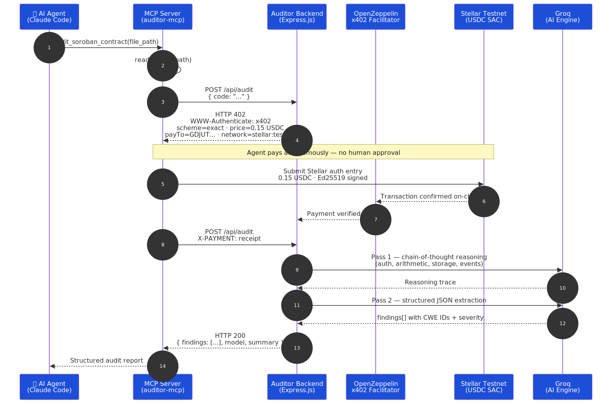
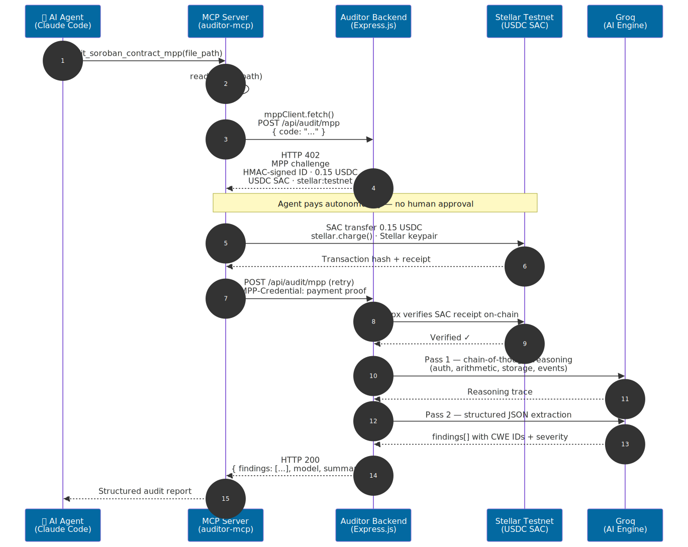

# Soroban Security Auditor — AI Agent with Autonomous On-Chain Payments

> An AI agent that audits Soroban smart contracts and pays for every audit autonomously — no subscriptions, no API keys, no human approval. Built on Stellar's **x402** and **Stripe MPP** payment protocols.

Built for **[Stellar Hacks: Agents](https://dorahacks.io/hackathon/stellar-agents-x402-stripe-mpp/detail)** — April 2026.

---

## Demo Video

[](https://youtu.be/3j3tb_MzW5w?si=o8K1YhYxbA1X7tm0)

---

## What It Does

An AI agent (Claude Code, or any MCP-compatible agent) reads your Soroban `.rs` contract, pays **0.15 USDC on Stellar Testnet** in a single autonomous transaction, and returns a structured security report with CWE IDs, severity levels, and exact code fixes — all without a human touching a wallet.

The backend grounds every audit in curated Soroban security knowledge via a **local RAG pipeline** (all-MiniLM-L6-v2, runs in Node.js, no API key) — retrieving the most relevant chunks from 7 security docs (Sanctifier S001–S012, OpenZeppelin Stellar Contracts audits, CVE advisories) before each AI pass.

---

## Live Proof — Real Stellar Testnet Transactions

These are real on-chain payments made autonomously by the AI agent during development and testing. No human signed these.

| # | Transaction | Protocol |
|---|---|---|
| 1 | [9fb39f21...](https://stellar.expert/explorer/testnet/tx/9fb39f21bcbce4c2ff2a83f9c5dc4b3a6d25d22b68217db70af7d650c495332c) | x402 |
| 2 | [520d4231...](https://stellar.expert/explorer/testnet/tx/520d4231ea22689e0730df16d1ed7822c7add6a1a81b61413d6c3a0e839e8096) | x402 |
| 3 | [70624854...](https://stellar.expert/explorer/testnet/tx/70624854692579889684f6f1b86238de892ac3e4a2f87caf12e8633ba9be15f6) | Stripe MPP |
| 4 | [92e0679a...](https://stellar.expert/explorer/testnet/tx/92e0679a05b9be0ba21773a9008d59dc1ad0008694b86a927cb02185bbbf5f56) | Stripe MPP |

---

## Architecture



---

## Sequence Diagrams

### x402 Payment Flow



### Stripe MPP Flow



---

## Quick Start — Use the Auditor in 3 Steps

### Step 1 — Get a funded Stellar Testnet wallet

You need a Stellar Testnet keypair with a USDC trustline. The easiest way:

1. Go to [Stellar Laboratory](https://laboratory.stellar.org/#account-creator?network=test) and generate a keypair
2. Fund it with Friendbot (free testnet XLM — button on the same page)
3. Add a USDC trustline at [Stellar Laboratory → Transactions → Build Transaction](https://laboratory.stellar.org)
4. Get free testnet USDC from [Circle's testnet faucet](https://faucet.circle.com) — select **Stellar Testnet**

You'll end up with a secret key starting with `S...` and at least 1 USDC. That's all you need.

### Step 2 — Add to your MCP config

**Claude Code** — add to `.mcp.json` in your project root (or `~/.claude.json` for global):

```json
{
  "mcpServers": {
    "auditor-mcp": {
      "command": "npx",
      "args": ["-y", "auditor-mcp"],
      "env": {
        "STELLAR_SECRET_KEY": "your-stellar-testnet-secret-key"
      }
    }
  }
}
```

**Cursor** — add to `~/.cursor/mcp.json` with the same structure.

> The MCP server connects to the hosted backend automatically. No other config required.

### Step 3 — Run an audit

In Claude Code (or any MCP-compatible agent), just ask:

```
Audit /path/to/my_contract.rs for vulnerabilities using the Soroban auditor
```

Or target a specific tool:

```
Use audit_soroban_contract to audit /path/to/my_contract.rs
```

```
Use audit_soroban_contract_mpp to audit /path/to/my_contract.rs
```

Pass a **directory** to audit an entire project at once — all `.rs` files are discovered recursively and audited together for a single 0.15 USDC charge:

```
Audit the contracts/ directory using the Soroban auditor
```

The agent pays automatically. You'll get a full report in ~20 seconds with a Stellar transaction link as proof.

---

## Output

```json
{
  "auditId": "a1b2c3d4-...",
  "file": "/path/to/contract.rs",
  "filesAudited": ["/path/to/contract.rs"],
  "protocol": "x402 / Stellar Testnet",
  "walletAddress": "GDEMO...",
  "stellarTxUrl": "https://stellar.expert/explorer/testnet/tx/abc123...",
  "model": "llama-3.3-70b-versatile",
  "summary": "CRITICAL: 1 | HIGH: 2 | MEDIUM: 1",
  "findings": [
    {
      "vulnerability_type": "Missing require_auth",
      "severity": "CRITICAL",
      "confidence": 100,
      "affected_function": "execute",
      "cwe_id": "CWE-862",
      "suggested_fix": "Add `caller.require_auth();` as the first statement in `fn execute()` before any storage reads or token transfers.",
      "references": ["https://github.com/OpenZeppelin/stellar-contracts/blob/main/docs/sanctifier/S001.md"]
    }
  ],
  "reasoning": "## Authorization trace\nfn execute(): modifies state and triggers cross-contract call, but has NO require_auth()..."
}
```

The `reasoning` field contains the full chain-of-thought from Pass 1 — showing exactly how each vulnerability was identified. This is your audit trail.

---

## Audit Coverage

| Category | Vulnerabilities Detected |
|---|---|
| Authorization | Missing `require_auth()`, cross-contract auth loss, `#[has_role]` without `require_auth()` |
| Arithmetic | Overflow (CWE-190), underflow (CWE-191), division by zero, wrong numeric types |
| Storage | Unbounded Instance storage DoS, key collisions, TTL mismanagement |
| Error Handling | `unwrap()`/`expect()` panics, ignored `Result` values |
| Token Safety | SEP-41 deviations, blocklist bypass, missing burn checks |
| Type Safety | Val storage corruption (GHSA-PM4J-7R4Q-CCG8), unsafe casts |
| Access Control | Upgrade without timelock, single-admin risk |
| Events | Missing SEP-41 events, inconsistent topic counts |
| Cross-Contract | Unvalidated external addresses, ignored sub-call return values |

---

## Value Propositions

| User Persona | Real-World Scenario | Quantifiable Impact |
|---|---|---|
| DeFi developer | Needs a security audit before launching a Soroban lending protocol. Traditional firms charge $1,000s and take 4–8 weeks. | **$0.15/audit** vs $5k+ — 99% cost reduction. **~20 seconds** vs 4–8 weeks. Run on every commit, not just at launch. |
| Autonomous agent fleet | A security DAO runs 200+ contract audits per day with no human in the loop. Manual payment approval is impossible at that scale. | **$30/day** in fully autonomous on-chain spending. Zero human approvals. Every payment is a traceable, immutable Stellar ledger entry. |
| Dev tool builder | Wants per-call monetization without user accounts, billing setup, or subscriptions. | Stellar's ~$0.00001/tx fee makes $0.15 micropayments viable. **One middleware line** to monetize. Buyers need only a Stellar keypair — no signup. |
| Hackathon organizer | 100+ teams ship contracts under time pressure; most skip security review. | **100% audit coverage** for $75 in USDC — vs $0 budget for manual review of 100 submissions. Real on-chain transactions prove the protocol at scale. |

---

## Tech Stack

| Component | Technology |
|---|---|
| Agent integration | Model Context Protocol (MCP) |
| Payment protocol 1 | x402 (`@x402/fetch`, `@x402/express`) |
| Payment protocol 2 | Stripe MPP (`@stellar/mpp`, `mppx`) |
| Blockchain | Stellar Testnet |
| Payment asset | USDC (Stellar SAC) |
| Payment facilitator | OpenZeppelin Built-on-Stellar x402 |
| Gateway server | Express.js (TypeScript) |
| RAG embedding model | `all-MiniLM-L6-v2` via `@xenova/transformers` (local ONNX, no API key) |
| RAG knowledge base | 7 curated Soroban security docs — Sanctifier S001–S012, OpenZeppelin Stellar Contracts, CVE advisories |
| AI model | Groq `llama-3.3-70b-versatile` |
| Audit price | 0.15 USDC per request |

---

## Project Structure

```
stellar/
├── auditor-backend/          # Express.js gateway + AI engine
│   ├── src/
│   │   ├── index.ts          # Routes: /api/audit (x402), /api/audit/mpp (MPP)
│   │   ├── auditor.ts        # Two-pass AI audit engine (Groq) + RAG injection
│   │   ├── mpp.ts            # Stellar MPP paywall middleware (mppx)
│   │   ├── demo.ts           # Web UI demo endpoint (server-side payment)
│   │   └── rag/
│   │       ├── rag.ts        # buildIndex() + retrieve() — local cosine similarity
│   │       └── docs.ts       # 7 curated Soroban security docs (hardcoded)
│   └── .env.example
│
├── auditor-mcp/              # MCP server (published to npm as auditor-mcp)
│   ├── src/
│   │   ├── index.ts          # MCP tools: audit_soroban_contract, audit_soroban_contract_mpp
│   │   └── stellar/          # x402 Stellar client implementation
│   └── .env.example
│
└── contracts/                # Sample Soroban contracts for demo and testing
    ├── defi_lending.rs       # Overcollateralized lending — missing auth on liquidate, overflow
    ├── token_bridge.rs       # Cross-chain bridge — unvalidated token address, missing events
    ├── staking_rewards.rs    # Yield farming — unbounded Instance storage, TTL mismanagement
    ├── nft_marketplace.rs    # NFT marketplace — cancel auth bypass, upgrade without timelock
    ├── dao_governance.rs     # DAO voting — missing execute auth, unbounded vote storage
    └── yield_aggregator.rs   # Auto-compounding vault — unauthorized harvest, overflow
```

---

## Self-Hosting the Backend

If you want to run your own backend instead of using the hosted version:

```bash
cd auditor-backend
cp .env.example .env
# Edit .env — see Environment Variables below
npm install
npm run dev        # development
npm run build && npm start   # production
```

### Environment Variables — `auditor-backend/.env`

| Variable | Required | Description |
|---|---|---|
| `TESTNET_SERVER_STELLAR_ADDRESS` | Yes | Your Stellar Testnet public key (receives payments) |
| `TESTNET_FACILITATOR_URL` | Yes | `https://channels.openzeppelin.com/x402/testnet` |
| `TESTNET_FACILITATOR_API_KEY` | Yes | From [channels.openzeppelin.com](https://channels.openzeppelin.com/testnet/gen) |
| `GROQ_API_KEY` | Yes | From [console.groq.com/keys](https://console.groq.com/keys) (free tier) |
| `GROQ_MODEL` | No | `llama-3.3-70b-versatile` (default) |
| `MPP_SECRET_KEY` | Yes | Any strong random string — signs MPP payment challenges |
| `DEMO_CLIENT_STELLAR_SECRET` | No | Demo wallet secret key (for web UI demo endpoint) |
| `PORT` | No | `3001` (default) |

Point `auditor-mcp` at your local backend by setting these in `.mcp.json`:

```json
"env": {
  "STELLAR_SECRET_KEY": "your-key",
  "AUDIT_GATEWAY_URL": "http://localhost:3001/api/audit",
  "MPP_AUDIT_GATEWAY_URL": "http://localhost:3001/api/audit/mpp"
}
```

---

## Security Note

The vulnerability detection is AI-powered and intended as a **first-pass screening tool**, not a replacement for a full manual audit on high-value production contracts. Findings with confidence < 50% are suppressed. The full chain-of-thought reasoning is included in every response for review.

---

*Built for Stellar Hacks: Agents — April 2026*
